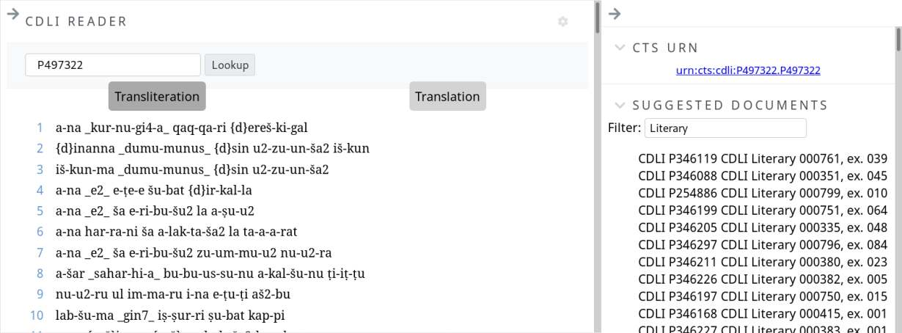

# CDLI supports Canonical Text Services
---

The Cuneiforn Digital Library Initiative participated in Google's
*Summer of Code* program this year, which pairs students with
open source programming projects.

One of the projects was to make cuneiform transcriptions and
translations from its the extensive database available in
TEI-XML laid out in the file hierarchy described by the
*Canonical Text Services* model used by digital humanities
project working with texts from the ancient world.

CDLI publishes under and open data model and this new export
format allows scholars and students to access and build on
the data in new ways. The CTS standard is the basis for the
new Scaife online reading environment developed for the Perseus
Open Greek and Latin project. By supporting common formats
we can make use of common tools across multiple scholarly
communities.

A [repository is available](https://github.com/cdli-gh/cdli-cts/)
now with a test export of a subset of the data for any researchers
who want to try it out.

CDLI was one of 204 organizations awarded participation in this
year's Summer of Code program. Five students were selected and
participated with the project this year.

Ralph Giles, student, CDLI Summer of Code.
Willis Monroe, mentor. Postdoctoral Fellow, University of British Columbia.
Émilie Pagé-Perron, Technical Director, Cuneiform Digital Library.

Date: 
2019/08/19
